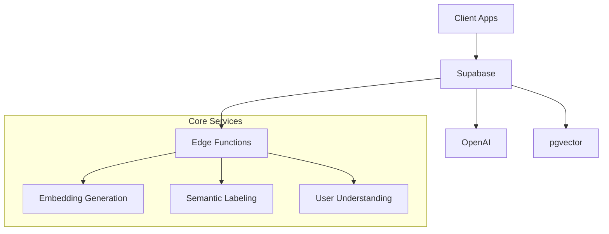

# Jean Connect
Official repository of Jean Technologies and our flagship product, Jean Connect.

## Core Vision
Jean is the "FICO for user understanding" that solves the cold-start problem through:
1. Zero-shot user understanding from social data
2. Universal embedding translation layer
3. Shared semantic label space for cross-domain understanding

## System Architecture



## Technical Stack
- Supabase (Auth, Database, Vector Storage)
- OpenAI (Embedding Generation)
- TypeScript/Node.js
- React (Connect UI)
- Edge Functions (Core Logic)

## File Structure Checklist
```
jean_v2/
├── supabase/
│   ├── [ ] migrations/
│   │   └── [ ] 00000000000000_initial.sql
│   ├── [ ] functions/
│   │   ├── [ ] generate_embedding.ts
│   │   ├── [ ] understand_user.ts
│   │   └── [ ] find_similar.ts
│   └── [ ] config.toml
│
├── src/
│   ├── lib/
│   │   ├── [ ] supabase.ts
│   │   ├── [ ] openai.ts
│   │   └── [ ] types.ts
│   │
│   ├── components/
│   │   ├── [ ] ConnectFlow.tsx
│   │   ├── [ ] PlatformSelect.tsx
│   │   └── [ ] UserInsights.tsx
│   │
│   ├── hooks/
│   │   ├── [ ] useUnderstanding.ts
│   │   └── [ ] useSocialConnect.ts
│   │
│   └── utils/
│       ├── [ ] validation.ts
│       └── [ ] errors.ts
│
├── [ ] package.json
└── [ ] README.md
```

## Database Schema
```sql
-- To be implemented:
1. [ ] users table
2. [ ] social_profiles table
3. [ ] embeddings table
4. [ ] semantic_labels table
5. [ ] companies table
```

## Core Features Checklist
1. [ ] Social Authentication
   - [ ] LinkedIn OAuth
   - [ ] GitHub OAuth
   - [ ] Google OAuth

2. [ ] Embedding Generation
   - [ ] Context processing
   - [ ] OpenAI integration
   - [ ] Vector storage

3. [ ] Semantic Labeling
   - [ ] Label generation
   - [ ] Hierarchical organization
   - [ ] Cross-domain mapping

4. [ ] User Understanding
   - [ ] Zero-shot analysis
   - [ ] Preference detection
   - [ ] Similar user finding

5. [ ] API & SDK
   - [ ] TypeScript SDK
   - [ ] API documentation
   - [ ] Usage examples

## Environment Variables Needed
```bash
NEXT_PUBLIC_SUPABASE_URL=
NEXT_PUBLIC_SUPABASE_ANON_KEY=
SUPABASE_SERVICE_ROLE_KEY=
OPENAI_API_KEY=
LINKEDIN_CLIENT_ID=
LINKEDIN_CLIENT_SECRET=
```

## Testing Requirements
- [ ] Unit tests for core functions
- [ ] Integration tests for data flow
- [ ] E2E tests for user flows

## Notes
- Focus on type safety throughout
- Implement RLS for security
- Use edge functions for performance
- Keep SDK simple but powerful

This context will be updated as we build. Mark items with [x] as they are completed.
