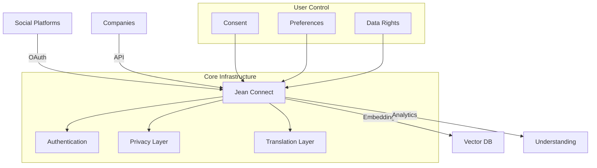
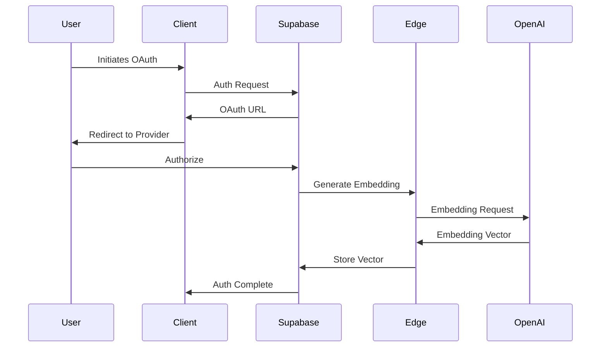

# Jean Connect

Jean Connect is a universal embedding protocol that enables companies to share and translate user embeddings across different domains while maintaining privacy and user control. Think "FICO score for user understanding" - we connect companies to their users' digital footprint, generate immediate user insights, and enable shared understanding across platforms.

## 🎯 Core Vision & Market Opportunity

Jean solves the cold-start problem and democratizes user understanding through:

1. **Zero-Shot Understanding**: Immediate user insights from social data without requiring historical behavior
2. **Universal Translation Layer**: Cross-domain embedding compatibility through semantic alignment
3. **User-Controlled Data**: Privacy-preserving protocol where users own their digital identity



## 🏗️ System Architecture

### Authentication Flow


## 💻 Technical Implementation

### Core Technologies
- **Frontend**: Next.js 14, React 19, TailwindCSS
- **Backend**: Supabase (Auth, DB, Storage), Edge Functions
- **AI/ML**: OpenAI API (text-embedding-3-large)
- **Vector Storage**: pgvector
- **Type Safety**: TypeScript throughout
- **Testing**: Jest, React Testing Library

### Key Features Status

#### Authentication & Social Integration
- [x] Supabase Auth integration
- [x] Google OAuth
- [x] LinkedIn OIDC
- [ ] GitHub OAuth (Planned)

#### Embedding Infrastructure
- [x] OpenAI API integration
- [x] Vector storage with pgvector
- [x] Basic similarity search
- [ ] Semantic translation layer (In Progress)

#### User Understanding
- [x] Zero-shot embeddings
- [x] Basic semantic labeling
- [ ] Cross-domain mapping (Planned)
- [ ] Advanced preference detection (Planned)

#### Privacy & Security
- [x] Row Level Security (RLS)
- [x] User consent management
- [x] Token refresh handling
- [ ] Advanced encryption layer (Planned)

## 📦 Project Structure

```
jean_connect/
├── src/
│   ├── app/                    # Next.js 14 App Router
│   │   ├── api/               # Route Handlers
│   │   ├── auth/              # Auth Flow
│   │   └── (routes)/         # App Routes
│   ├── components/            # React Components
│   │   ├── ConnectFlow/      # Social Connection UI
│   │   └── UserInsights/     # Analytics Display
│   ├── lib/                   # Core Libraries
│   │   ├── supabase/         # Database Client
│   │   └── openai/           # AI Integration
│   └── utils/                 # Shared Utilities
├── supabase/
│   ├── migrations/           # Database Schema
│   └── functions/           # Edge Functions
└── tests/                   # Test Suite
```

## 🛠️ Development Setup

### Prerequisites
- Node.js >= 18.17.0
- PostgreSQL 13+
- Supabase CLI
- OpenAI API access

### Environment Variables
```bash
# Core Configuration
NEXT_PUBLIC_SUPABASE_URL=your-project-url
NEXT_PUBLIC_SUPABASE_ANON_KEY=your-anon-key
SUPABASE_SERVICE_ROLE_KEY=your-service-key

# OAuth Providers
NEXT_PUBLIC_GOOGLE_CLIENT_ID=your-google-id
GOOGLE_CLIENT_SECRET=your-google-secret
NEXT_PUBLIC_LINKEDIN_CLIENT_ID=your-linkedin-id
LINKEDIN_CLIENT_SECRET=your-linkedin-secret

# AI/ML
OPENAI_API_KEY=your-openai-key

# Deployment
NEXT_PUBLIC_SITE_URL=your-site-url
```

### Installation & Setup
```bash
# Install dependencies
npm install

# Setup database
supabase start
npm run migrate

# Start development server
npm run dev
```

## 📊 Database Schema

### Core Tables
```sql
-- Users and their metadata
CREATE TABLE public.users (
  id UUID PRIMARY KEY,
  email TEXT,
  full_name TEXT,
  avatar_url TEXT,
  updated_at TIMESTAMP WITH TIME ZONE
);

-- Social platform connections
CREATE TABLE public.social_profiles (
  id UUID PRIMARY KEY,
  user_id UUID REFERENCES public.users(id),
  platform TEXT NOT NULL,
  platform_user_id TEXT NOT NULL,
  access_token TEXT,
  profile_data JSONB
);

-- User embeddings
CREATE TABLE public.embeddings (
  id UUID PRIMARY KEY,
  user_id UUID REFERENCES public.users(id),
  vector VECTOR(1536),
  metadata JSONB
);

-- Semantic understanding
CREATE TABLE public.semantic_labels (
  id UUID PRIMARY KEY,
  user_id UUID REFERENCES public.users(id),
  label TEXT NOT NULL,
  confidence FLOAT NOT NULL
);
```

## 🔒 Security Considerations

- Row Level Security (RLS) enabled on all tables
- OAuth tokens stored securely with refresh rotation
- Edge functions for sensitive operations
- User consent required for all data access
- Data encryption in transit and at rest

## 🚀 Roadmap

### Phase 1: Foundation (Current)
- [x] Core authentication flow
- [x] Basic embedding generation
- [x] Initial social integrations
- [ ] Complete test coverage

### Phase 2: Enhancement
- [ ] Semantic translation layer
- [ ] Additional social platforms
- [ ] Advanced analytics dashboard
- [ ] SDK development

### Phase 3: Scale
- [ ] Enterprise features
- [ ] Advanced privacy controls
- [ ] Real-time updates
- [ ] Custom embedding models

## 👥 Contributing

See [CONTRIBUTING.md](CONTRIBUTING.md) for development guidelines.

## 📄 License

MIT License - see [LICENSE](LICENSE) for details.